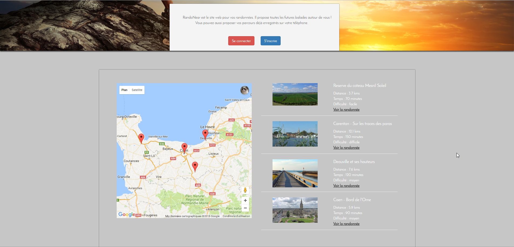

# Randoweb

Randoweb is my first project using Symfony.
Randoweb was my topic in a supervised project for my first year in Master DNR2I.

Thanks to this website you can find hikings around you using the GPS Location of your laptop / phone / Tablet. 
You can also create a new hiking thanks to GPX File. A marker is created on the map thanks to the metadata in the file you just uploaded. A topic / comment system is also implemented for each hikings. 




### Installing

Clone the repository

```
git clone https://github.com/lcouellan/randoweb.git

cd randoweb
```


Install the dependencies

```
php composer.phar update
```

Create your database and get the data

```
php bin/console doctrine:schema:update --force
php bin/console doctrine:fixtures:load
```

Run the server

```
php bin/console server:run
```


## Built With

* [`Symfony 3`](https://symfony.com/)
* [`BootStrap`](http://getbootstrap.com/)
* [`PhpStorm`](https://www.jetbrains.com/phpstorm/)


## License

This project is licensed under the GNU License - see the [LICENCE](LICENSE) file for details

